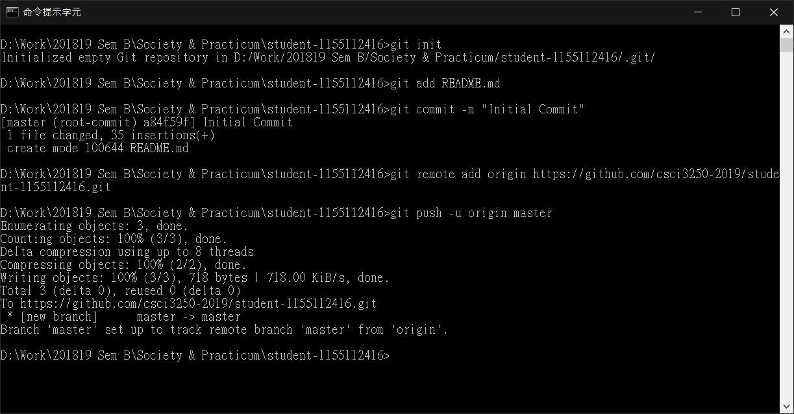

# Little Something About Myself 👻

Hello Everyone! I am **Bobby Chan**, a Year Three Computer Science Student in Chinese University of Hong Kong

## About Me

* Love Gaming 🎮
* Would like to create my own game 👾
* New to GitHub ✨

## The Project Tasks

- [x] Project Milestone #1
- [ ] Project Milestone #2
- [ ] Project Milestone #3

## Time and Date Finishing the Above Tasks

Project Tasks | Finished Time
--------------|--------------
Project Milestone #1 | 2019-04-19 9:44 P.M.
Project Milestone #2 | N/A
Project Milestone #3 | N/A

## Screenshot

## Author

- **Bobby Chan** - [bobby2128](https://github.com/bobby2128)

## Acknowledgement

- [Standard-Readme](https://github.com/RichardLitt/standard-readme) - Standard Readme Style
